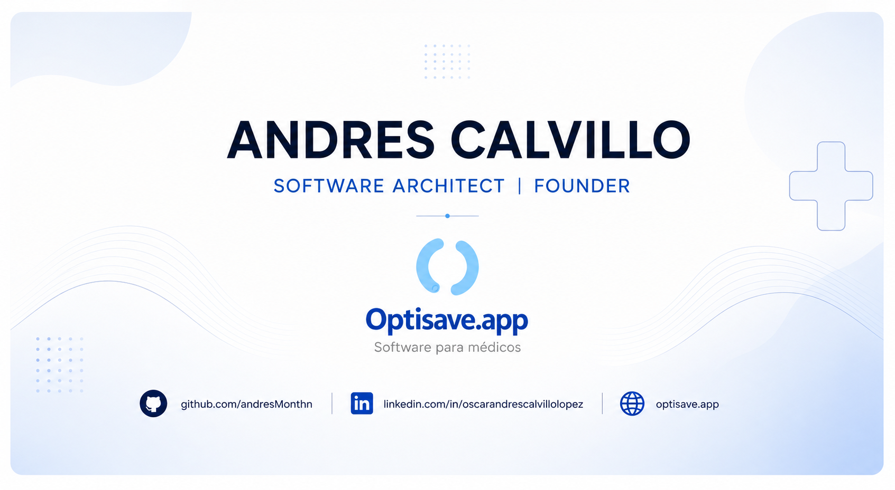

  

<h1 align="center">Hola, soy Andrés Calvillo 👋</h1>

<h3 align="center">
Software Architect • SaaS Builder • Founder
</h3>

Construyendo plataformas SaaS para transformar la operación de consultorios y clínicas mediante software escalable, automatización y una arquitectura preparada para el futuro.

---

# 👨‍💻 Sobre mí

Soy Arquitecto de Software especializado en el diseño y desarrollo de plataformas empresariales.

Actualmente construyo **[Optisave](https://optisave.app)**, una plataforma SaaS enfocada en la transformación digital del sector salud, desarrollando cada componente desde la arquitectura hasta su implementación en producción.

Mi enfoque es crear software que permanezca vigente durante años mediante una arquitectura sólida, mantenible y escalable.

---

# 🚀 Actualmente construyendo

## 🏥 Optisave

Plataforma SaaS para consultorios y clínicas.

### Actualmente incluye

- 📅 Agenda Médica
- 🩺 Expediente Clínico Electrónico
- 👥 Gestión de Pacientes
- 📂 Gestión Documental
- 📦 Inventario
- 📊 Reportes y Analytics
- 💬 Automatización mediante WhatsApp
- 🔐 Seguridad basada en Roles (RBAC)
- 🏢 Arquitectura Multi-Tenant

---

# 🧠 Engineering Focus

Me especializo en construir sistemas empresariales de largo plazo.

- SaaS Architecture
- Multi-Tenant Applications
- System Design
- REST API Design
- Authentication & Authorization
- RBAC
- Clean Architecture
- Component-Based Architecture
- Event-Driven Systems
- Real-Time Applications
- Performance Optimization
- Scalable Software

---

# 💻 Engineering Stack

## Languages

- TypeScript
- JavaScript (ES6+)
- PHP
- SQL
- Python

## Frontend

- React
- Next.js
- Tailwind CSS
- HTML5
- CSS3
- shadcn/ui

## Backend

- Laravel
- Node.js
- Express.js
- REST APIs
- JWT Authentication

## Database

- PostgreSQL
- MySQL
- Supabase

## DevOps

- Docker
- Git
- GitHub
- CI/CD
- Linux
- Vercel

## Automation

- Evolution API
- Baileys
- WhatsApp Automation
- LLM Integration
- Retrieval-Augmented Generation (RAG)

---

# 🏗️ Proyectos Destacados

## 🩺 Optisave

Sistema SaaS para la administración integral de consultorios médicos.

**Estado:** 🚧 En desarrollo activo

Tecnologías:

- Laravel
- React
- PostgreSQL
- Docker
- TypeScript

---

## 🎹 Web Piano

Aplicación interactiva desarrollada con React + TypeScript.

👉 https://github.com/andresMonthn/WebPiano

---

## 🍎 CountCalory

Aplicación para seguimiento nutricional.

👉 https://countcalory.onrender.com/

---

# 📚 Actualmente aprendiendo

- Domain Driven Design
- Arquitecturas Distribuidas
- Observabilidad
- Cloud Native
- Testing Estratégico
- Arquitectura Empresarial

---

# 💭 Filosofía

> No construyo software para demostrar tecnología.

Construyo productos que resuelven problemas reales mediante una arquitectura preparada para evolucionar durante años.

Creo que el mejor software no es el que tiene más funcionalidades.

Es el que ofrece estabilidad, simplicidad y una excelente experiencia para quienes lo utilizan todos los días.

---

# 📈 Roadmap Público de Optisave

- ✅ CRM Médico
- ✅ Agenda
- ✅ Gestión de Pacientes
- ✅ Inventario
- 🚧 Expediente Clínico
- 🚧 Dashboard Analítico
- 🚧 Automatización WhatsApp
- 🔜 Portal para Pacientes
- 🔜 Aplicación Móvil

---

# 📫 Conecta conmigo

🌐 Sitio Web

https://optisave.app

💼 LinkedIn

https://linkedin.com/in/oscarandrescalvillolopez

📧 Email

andres.777.monthana@gmail.com

🐙 GitHub

https://github.com/andresMonthn
